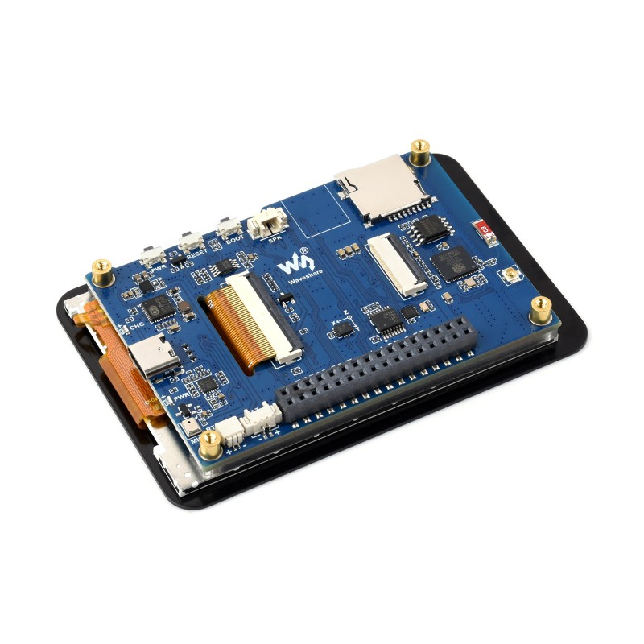
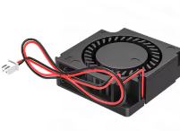

# RTK Server (Multi miner) with Waveshare ESP32 S3 3.5" Touch 

This project connects a UM980 or UM982 RTK GNSS receiver to a Waveshare ESP32 S3 3.5" Touch allowing you to share RTK correction data with up to three networks at one time (Some give mining rewards). The ESP32 will automatically program the UM980/2 so there is no need to mess around with terminals or or the UPrecise software.

This system uses a fancy large touch screen so you will be the envy of you friends and attract many potential mates.

Warning - Build this masterpiece and you might need crowd control at your workbench. Forget pickup lines; nothing says “mysterious genius” like precision soldering and flawless GNSS integration. Just make sure your ESP32 isn’t the only thing handling all the signals! 

All up you it will cost about US$275 to make the station with GNSS receiver, antenna and ESP32 with display. 

The display also allow you to see at an instant if the system is connected and sending to all the casters

	
	
	
	
	
	

NOTE : Using ESP32 S3 allows sending to up to three RTK casters without blocking.

## Table of Contents 
 
- [Hardware](#hardware)  
  - [Components](#components)
  - [Wiring Diagram](#wiring-diagram) 
- [Software](#software)  
  - [Features](#features)
  - [Connect WiFi](#connect-wifi) 
  - [Doing your own mods](#modifying-the-code-and-doing-your-own-thing)
- [Getting Credentails](#Getting-Credentails) 
  - [Usage](#usage)
- [License](#license)

## Hardware 

### Shopping notes

Note :  These links only get you to the page. You still need to pick the "Color:" of each item. Meaning the actual item. (Again, these are not affiliate links. Shop around to get the best deal for you. Double check shipping of each selection)

IMPORTANT : When you buy stuff from AliExpress. The link is just general to the product type. You MUST select the correct model or you may accidentally end up with the Antenna or PCB?

Here is my AliExpress affiliate link https://s.click.aliexpress.com/e/_op3HJqa. Use it if you are bored. Pretty sure it does not work with the products below.

If you purchase a PCB and housing, be sure to combine the PCB and housing into one order to save on shipping

### Components 
 
<table>
	<tr>
		<td width="70%">
			<b>Waveshare S3 3.5" Touch</b> (Standard Ver.) - US$25.99  ESP32-S3 3.5inch Capacitive Touch Display Development Board Type B, 320×480 Pixels, IPS Panel, 262K Color, Supports Wi-Fi and Bluetooth 5, ESP32 With Display  <a href="https://www.waveshare.com/esp32-s3-touch-lcd-3.5b.htm?&aff_id=117711">[Buy with my referral link]</a>
		</td>
		<td>
			
		</td>
	</tr>
	<tr>
		<td>
			<b>**UM980 with antenna**</b> - US$180.00  Witte Intelligent WTRTK-982 high-precision positioning and orientation module. I got it from AliExpress for about US$180.00  [Not affiliate link] https://www.aliexpress.com/item/1005009184512773.html
		</td>
		<td>
			
		</td>
	</tr>
	<tr>
		<td>
			<b>Fan</b> - US$5.00. 5V Radial fan 3101. Radial fans are quieter. Ball bearing ones are best. I used  https://vi.aliexpress.com/item/1005007887849652.html
		</td>
		<td>
			
		</td>
	</tr>
</table>

[PCB and 3D files can be found here](NOT READY)

Use the Gerber files for the PCB and the STEP files for the housing. I'd recommend printing the housing in PETG or ABS if the housing is likely to get above 30°C. Otherwise PLA is fine.

[CAD model for the housing can be found here](NOT READY)

## Wiring Diagram

| Waveshare Use | Waveshare Pin | UM980 Pin | UM980 Use | Fan
| --- | --- | --- | --- | --- |
| 5V | 2| 2 | 5V | Red
| GND | 4 | 5 | GND | Black
| NC | |  |  |
| NC | |  |  |
| GPIO 17 - TX | 16 | 3 | RX |
| GPIO 18 - RX | 18 | 4 | TX |

	

## Software 

### Features 

- Connected to UM980 or 2.
 
- Connects to Wifi.

- Programs the UM982 to send generate RTK correction data

- Sends correction data to all RTK Casters

### ESP32 device setup

You will need to install the software onto the new Waveshare device. You can install it before connecting anything up just to see how it works.

 - [How to upload software](README_Upload.md)

Remember it can take up to 3 minutes to startup the first time new firmware has been loaded on the Waveshare.

### Connect WIFI

- Connect ESP32 to your HOME WiFi
	- Power up the Waveshare (GPS does not need to be connected)
	- Using your phone or computer
	- Connect to the WIFI access point Rtk_XXXXXXXX (Mac address shown on ESP32 screen)
	- Password will be `John123456`
	- Browse to http://192.168.4.1 (This may happen automatically)
	- Select "Configure WiFi"
	- Select your HOME WiFi network and enter the credentials
	- Select Save
- Connect your phone or computer to you HOME WiFi 
	- You should be able to browse to the WiFi address shown on the ESP32 screen (NOT 192.168.4.1) or use the 

### Config parameters 

Config can be found by browsing to http://RtkServer.local/settings

Note : You don't need to sign up to all three. Leave the CASTER ADDRESS blank to only use one or two casters. 

| Parameter | Usage | 
| --- | --- | 
| CASTER ADDRESS | Usually "servers.onocoy.com" |
| CASTER PORT | Port usually 2101 (0 to disable) |
| CASTER CREDENTIAL | This is the reference station Credential. NOT the Mount point name |
| CASTER PASSWORD | Sign up to get this from Onocoy |
| Multicast DNS | Name to use to access this portal on the local domain. Don't mess with this unless you have more than one RtkServer |
| Time zone | Correction for UTC time. Used when writing to the logs |
| Station calibration location | Leave this blank for now |

WARNING :  Do not run without real credentials or your IP may be blocked!! Set the port to zero to disable the endpoint without deleteing the credentials

### Getting Credentails 

1. Create the accounts with [Oncony register](https://console.onocoy.com/auth/register/personal), [RtkDirect](https://cloud.rtkdirect.com/) or [RTK2GO](http://rtk2go.com/sample-page/new-reservation/)

2. Don't wire up anything to start with (We can let the smoke out of it later)

3. Upload the program to your ESP32. 

4. Power it up and check display for WIFI connection status.

5. Following instruction at [WifiManager](https://github.com/tzapu/WiFiManager) to connect your ESP32 to your WIFI.

6. Configure the RTK Servers you want to use in the "Configure Wifi" Screen.

7. Wire up the ESP32 to UM98x. Power it fom UM98x (Sometime the ESP32 doesn't output enough beans).

8. Review the status and logs through the web interface (http://x.x.x.x/i)

### Display

The display has several screens you can toggle through them by swiping on the screen or tapping buttons.

The top line of the Home and settings display shows the following

| Type | Usage | 
| --- | --- | 
| 🔋 | Battery percentage |
| Time | Day and date |
| 🛜 | Connection state of WIFI |
| 🛰️ | Connection State to UM98x |
| S1 | Connection state of RTK Server 1 |
| S2 | Connection state of RTK Server 2 |
| S3 | Connection state of RTK Server 3 |

### Home

| Title | Meaning | 
| --- | --- | 
| Uptime | How long the system has been running. Rolls over every 76 days. | 
| GPS | Connection details including the number of bytes and packets received. Also reconnect count. | 
| WIFI | WiFi details. Check IP and host name  | 
| Server | Details about the data sent to each RTK caster | 

### Setting

| Title | Meaning | 
| --- | --- | 
| Power | Show the power screen | 
| System | Shows Flash, SD card and WiFi details | 
| CPU Temperature | Graph of CPU Temperature in °C | 
| Log | Review the system log | 
| Brightness | Control the screen brightness. This resets after restart |

### Power Page

| Title | Meaning | 
| --- | --- | 
| Battery | Charge state and level. Check the battery is charging here | 
| VBus | Which bus the device is powered from | 
| Voltages | Voltages for bus and battery | 
| CPU Temperature | Current CPU Temperature in °C | 

### System

	
SD Card, Flash and WiFi details

### Temperature Graph

### Log view

View the log and page up or down.

## License 
This project is licensed under the GNU General Public License - see the [LICENSE](https://github.com/mctainsh/Esp32/blob/main/LICENSE)  file for details.

---

